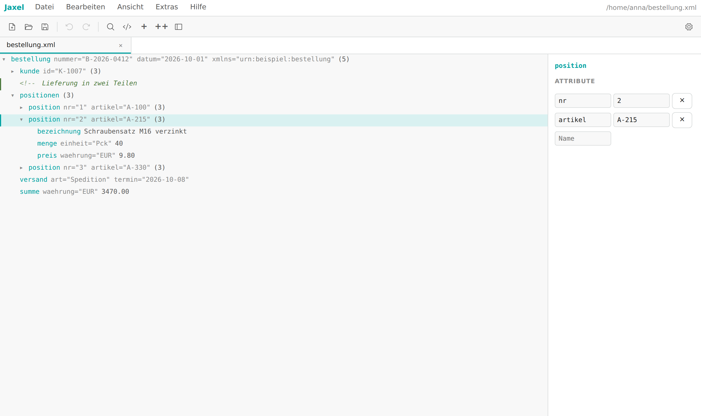
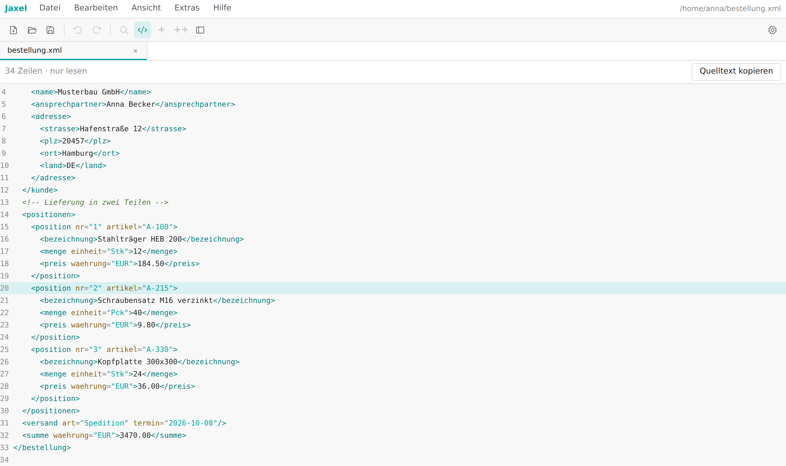
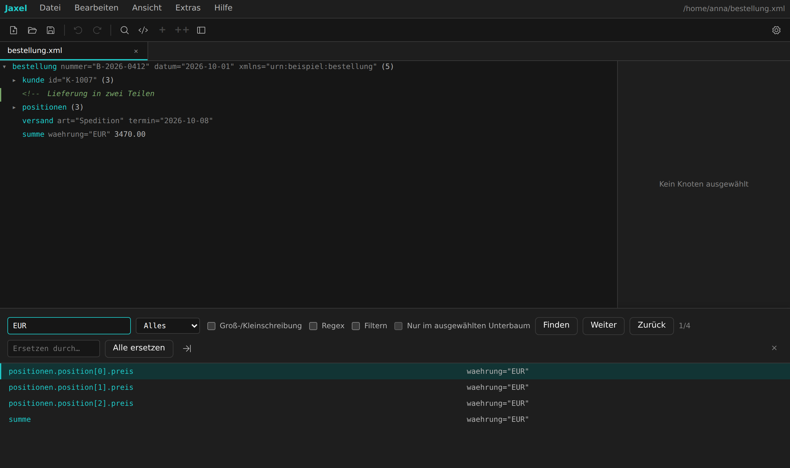
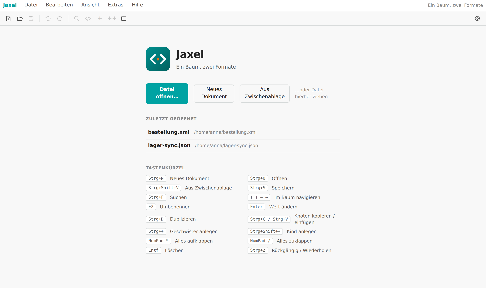

<p align="center">
  
</p>

<h1 align="center">Jaxel</h1>

<p align="center">
  XML-Editor für den Desktop, für Linux und Windows. Liest und bearbeitet auch JSON.
</p>

<p align="center">
  <a href="https://github.com/jojeji/jaxel/releases/latest"></a>
  <a href="https://github.com/jojeji/jaxel/actions/workflows/release.yml"></a>
</p>

<p align="center">
  
</p>

## Was ist Jaxel?

Mit Jaxel öffnest du XML-Dateien als Baum, suchst darin und änderst Namen, Werte und Attribute
direkt in der Zeile. Wir haben Jaxel als Ersatz für den Easy XML Editor gebaut, den es für Linux
nicht gibt. JSON-Dateien zeigt Jaxel im selben Baum.

Beim Speichern schreibt Jaxel nur die Knoten neu, die du geändert hast. Der Rest der Datei bleibt
Byte für Byte, wie er war, mit Einrückung, Kommentaren und Kodierung. Auch Dateien mit einigen
hundert MB kannst du flüssig durchblättern.

## Funktionen

- **Baumansicht** mit Tabs, Fokus auf einen Teilbaum und Pfad-Kopie (`bestellung.positionen.position[1]`).
- **Bearbeiten**: Knoten anlegen, duplizieren, löschen, per Drag&Drop verschieben, kopieren und
  einfügen, auch mehrere auf einmal. Jeden Schritt kannst du rückgängig machen.
- **XML-Kommentare**: Knoten aus- und wieder einkommentieren. Auskommentierte Bereiche zeigt Jaxel als Baum.
- **Suchen, Ersetzen, Filtern** in Namen, Werten und Attributen, auf Wunsch mit regulären Ausdrücken.
- **Quelltextansicht** (`Strg+U`): der Text, den Speichern jetzt schreiben würde, mit Zeilennummern und Färbung.
- **Aus der Zwischenablage** (`Strg+Shift+V`): ein kopiertes XML- oder JSON-Dokument als neuen Tab öffnen.
- **XML ↔ JSON umwandeln** über „Speichern unter“ mit der anderen Dateiendung.
- **Base64-Inhalte** erkennen und anzeigen. Eingebettete PDFs öffnet Jaxel im Standardprogramm.
- **Kodierungen**: UTF-8, UTF-16, ISO-8859-1 und Windows-1252. Jaxel speichert in der Kodierung,
  in der die Datei kam.
- **Schutz vor Datenverlust**: Jaxel fragt vor dem Schließen nach und meldet, wenn ein anderes
  Programm eine offene Datei geändert hat.
- **Oberfläche** auf Deutsch und Englisch, mit hellem, dunklem und weiteren Farbschemata.

XSD- und DTD-Validierung gehören nicht dazu.

<table>
  <tr>
    <td></td>
    <td></td>
  </tr>
  <tr>
    <td align="center">Quelltextansicht</td>
    <td align="center">Suchen und Ersetzen, dunkles Farbschema</td>
  </tr>
</table>

## Download

Die Pakete findest du unter **[Releases](https://github.com/jojeji/jaxel/releases/latest)**.

| Paket | System | Installation | Datei |
|---|---|---|---|
| AppImage | Linux x86_64 | keine | `Jaxel_<version>_amd64.AppImage` |
| Debian-Paket | Debian, Ubuntu | ja | `Jaxel_<version>_amd64.deb` |
| RPM-Paket | Fedora, openSUSE, RHEL | ja | `Jaxel-<version>-1.x86_64.rpm` |
| Installer | Windows 10/11 x64 | ja | `Jaxel_<version>_x64-setup.exe` |
| Portable | Windows 10/11 x64 | keine | `Jaxel_<version>_x64-portable.zip` |

Für macOS gibt es keine Builds.

## Installation

### Linux

AppImage: ausführbar machen und starten. Jaxel installiert dabei nichts.

```bash
chmod +x Jaxel_*_amd64.AppImage
./Jaxel_*_amd64.AppImage bestellung.xml
```

Debian und Ubuntu:

```bash
sudo apt install ./Jaxel_*_amd64.deb
```

Fedora (openSUSE: `sudo zypper install`):

```bash
sudo dnf install ./Jaxel-*.x86_64.rpm
```

Mit dem `.deb`- oder `.rpm`-Paket steht Jaxel für `.xml`, `.json` und `.ext` im „Öffnen mit“-Menü
des Dateimanagers. Fehlt der Eintrag, meldest du dich einmal ab und wieder an.

### Windows

Installer: `Jaxel_*_x64-setup.exe` starten. Danach findest du Jaxel im Startmenü und unter
„Öffnen mit“ für XML- und JSON-Dateien.

Portable: die ZIP an einen beliebigen Ort entpacken, auch auf einen USB-Stick, und
`jaxel-portable.exe` starten. Einstellungen und Logdatei landen im selben Ordner. Ist der Ordner
schreibgeschützt, nimmt Jaxel für diese Sitzung den normalen Benutzerordner und sagt dir das.

Jaxel braucht die Microsoft Edge WebView2 Runtime. Aktuelle Windows-10- und -11-Systeme haben
sie an Bord; der Installer ergänzt sie, wenn sie fehlt. Für die portable Variante muss sie da sein.

## Erste Schritte



- Datei öffnen mit `Strg+O`, per Drag&Drop aufs Fenster oder über die zuletzt geöffneten Dateien.
- Auf der Kommandozeile öffnet `jaxel a.xml b.json` jede Datei in einem eigenen Tab. Läuft Jaxel
  schon, kommen die Dateien als neue Tabs dazu.
- `F2` benennt um, `Enter` ändert den Wert, `Strg+F` sucht, `Strg+U` zeigt den Quelltext.

Alle Funktionen und Tastenkürzel stehen im **[Benutzerhandbuch](docs/benutzerhandbuch.md)**.

<br clear="right">

## Entwicklung

Du brauchst Node.js 20, Rust (stable) und die
[Tauri-2-Voraussetzungen](https://v2.tauri.app/start/prerequisites/). Unter Debian und Ubuntu:

```bash
sudo apt install libwebkit2gtk-4.1-dev libayatana-appindicator3-dev librsvg2-dev patchelf
```

Jaxel nutzt Tauri 2 mit React und TypeScript. `packages/core` enthält Baummodell, Undo/Redo,
Import, Export und Suche ohne UI. `apps/editor` enthält Oberfläche und Tauri-Hülle.

```bash
npm install
npx playwright install chromium   # einmalig, für die UI-Tests
npm run dev                       # im Wurzelverzeichnis starten
npm test
npm run typecheck
```

Starte `npm run dev` im Wurzelverzeichnis. Das gleichnamige Skript in `apps/editor` startet nur
Vite ohne Tauri-Fenster, und im normalen Browser schlägt dann jeder Dateizugriff fehl.

Pakete lokal bauen:

```bash
npm run tauri -- build --bundles appimage,deb,rpm    # Linux
npm run tauri -- build --bundles nsis                # Windows, nur auf Windows
```

Ein Release veröffentlichst du so: Version in `package.json`, `apps/editor/package.json` und
`apps/editor/src-tauri/tauri.conf.json` anheben, die Einträge in [CHANGELOG.md](CHANGELOG.md)
unter die neue Version schieben und den Tag `v<version>` pushen. GitHub Actions testet, baut alle
Pakete und legt das Release an.

## Lizenz

Für dieses Repository ist noch keine Lizenz festgelegt.
